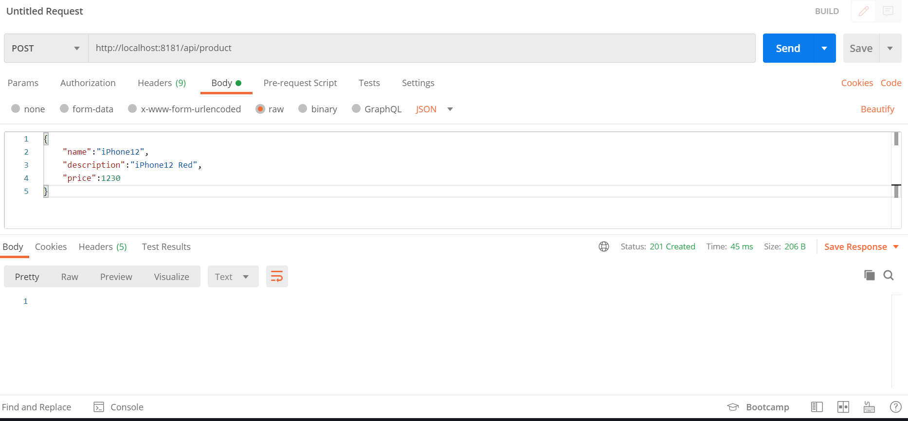
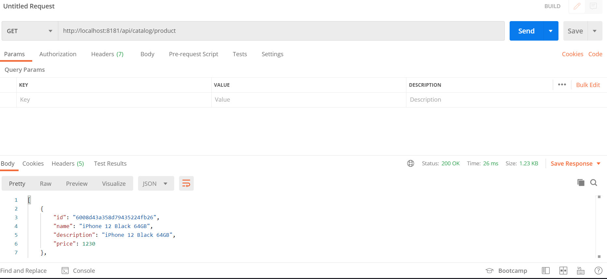
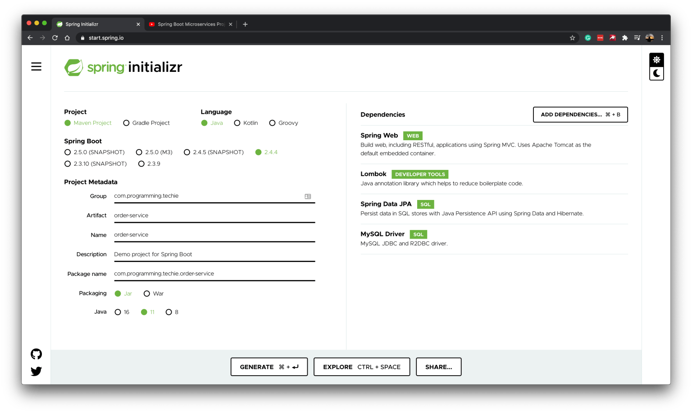

[[chapter-1]]
= Getting Started

== Our Sample Project Architecture

As part of this tutorial, we are going to build a Simple Online Shopping Application, the main focus of this tutorial will be to explain the Microservices Architecture and the implementation, so the functionality of the application will be minimal.

We are going to implement 4 Services.

* Product Service
* Order Service
* Inventory Service
* Notification Service

image::../../../../../tutorials/microservices tutorial/thumbnails/microservices-architecture.png[]

== Creating our First Microservice : Product Service

So let’s go ahead and implement our first microservice (*Product Service*), as we decided before, we are going to keep the functionality of this service to minimum.

We are going to expose a REST API endpoint which will CREATE and READ products.

|===
|Service Operation |HTTP METHOD |Service End point

|CREATE PRODUCT
|	POST
|	/api/product/

|READ ALL PRODUCTS
|GET
|	/api/product/
|===

To create the project, let’s go to https://start.spring.io/[start.spring.io] and create our project based on the following configuration:

image::../../../../../tutorials/microservices tutorial/thumbnails/spring initializer- product-service.png[]

We are going to use *MongoDB* as the database backing our *Product Service*

=== Configure MongoDB

We have to configure the MongoDB URI Details inside the `application.properties` file:

[source,text]
----
####### Mongo Properties ###########
spring.data.mongodb.uri=mongodb://localhost:27017/product-service
----

If you are not aware of how to work with MongoDB and Spring Boot, have a look at the Spring Boot MongoDB REST API Tutorial - https://programmingtechie.com/2021/01/06/spring-data-mongodb-tutorial/

=== Creating the Create and Read Endpoints

Let’s create the below model class which acts as the domain for the Products.

*Product.java*

[source, java]
.src/main/java/com/programming/techie/productservice/model/Product.java
----
package com.programming.techie.productservice.model;

import lombok.AllArgsConstructor;
import lombok.Builder;
import lombok.Data;
import lombok.NoArgsConstructor;
import org.springframework.data.mongodb.core.mapping.Document;

import java.math.BigDecimal;

@Document(value = "product")
@AllArgsConstructor
@NoArgsConstructor
@Builder
@Data
public class Product {
    private String id;
    private String name;
    private String description;
    private BigDecimal price;
}
----

*ProductController.java*

[source, java]
.src/main/java/com/programming/techie/productservice/controller/ProductRestController.java
----
package com.programming.techie.productservice.api;

import com.programming.techie.productservice.model.Product;
import com.programming.techie.productservice.repository.ProductRepository;
import lombok.RequiredArgsConstructor;
import org.springframework.http.ResponseEntity;
import org.springframework.web.bind.annotation.*;
import org.springframework.web.servlet.support.ServletUriComponentsBuilder;

import java.net.URI;
import java.util.List;

@RestController
@RequestMapping("/api/product")
@RequiredArgsConstructor
public class ProductRestController {

    private final ProductRepository productRepository;

    @GetMapping
    public List<Product> getAllProducts() {
        return productRepository.findAll();
    }

    @GetMapping("/{id}")
    public Product getAllProducts(@PathVariable String id) {
        return productRepository.findById(id).orElseThrow(() -> new RuntimeException("Cannot Find Product By ID: " + id));
    }

    @PostMapping
    public ResponseEntity<String> saveProduct(@RequestBody Product product) {
        Product savedProduct = productRepository.insert(product);
        URI uri = ServletUriComponentsBuilder.fromCurrentRequest()
                .path("/{id}")
                .buildAndExpand(savedProduct.getId())
                .toUri();
        return ResponseEntity.created(uri).build();
    }
}
----
*ProductRepository.java*

[source, java]
.src/main/java/com/programming/techie/productservice/repository/ProductRepository.java
----
package com.programming.techie.productservice.repository;

import com.programming.techie.productservice.model.Product;
import org.springframework.data.mongodb.repository.MongoRepository;

public interface ProductRepository extends MongoRepository<Product, String> {
}
----

=== Testing the APIs

Let’s start the application and test our two Endpoints

We will start of by creating a product, this REST call should return a status 201.

Now let’s make a GET call to test whether the created product is returned as a response or not.

== Creating Order Service

The second service we are going to create is the *Order Service*, this service only exposes a single POST endpoint called *placeOrder*

|===
|Service Operation |	Endpoint Method |	Service Endpoint

|PLACE ORDER
|POST
|	/api/order

|===

We are going to create the project using the below settings in https://start.spring.io/[start.spring.io] website.

In Order Service, we are going to use *MySQL* Database, so let’s go ahead and configure it in our project.

=== Configure MySQL Database

You can configure the following details inside the `application.properties` file

[source, text]

----
spring.datasource.url=jdbc:mysql://localhost:3306/order-service
spring.datasource.driver-class-name=com.mysql.cj.jdbc.Driver
spring.jpa.properties.hibernate.dialect=org.hibernate.dialect.MySQL8Dialect
spring.jpa.hibernate.ddl-auto=update
spring.datasource.initialization-mode=always
spring.jpa.show-sql=true
spring.datasource.username=root
spring.datasource.password=mysql
server.port=0
----

After adding the above configuration, make sure to create the schema `order-service` inside the MySQL database, before starting the application.

As we set the `server.port` property as `0`, the service will run on a *Random Port*.

This is the minimum configuration, which is needed to get started with the microservices project.

In the next chapter, we will learn how to implement Service Discovery using *Spring Cloud Netflix Eureka* and Configuration Server using *Spring Cloud Config* projects.

