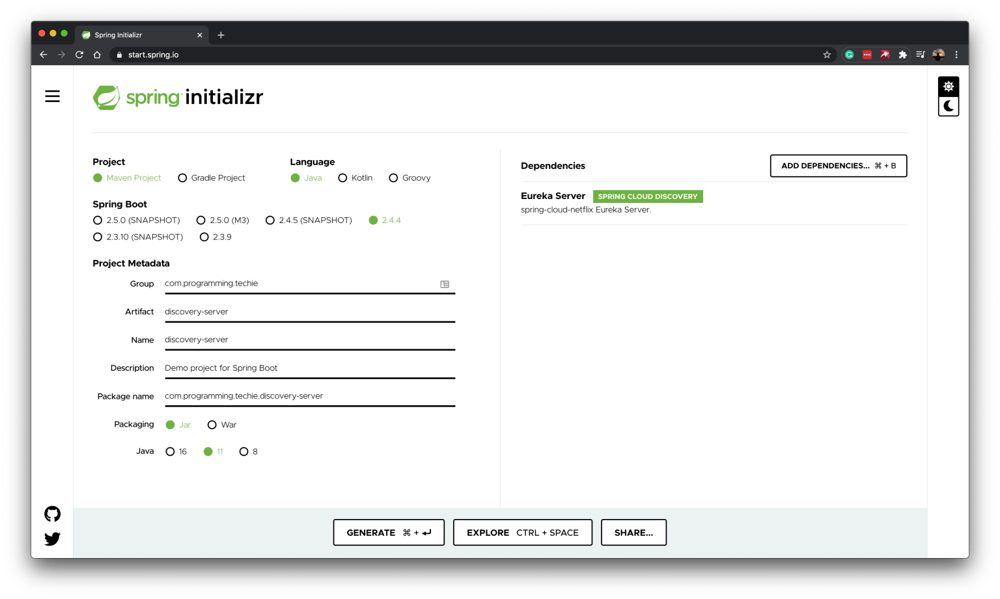
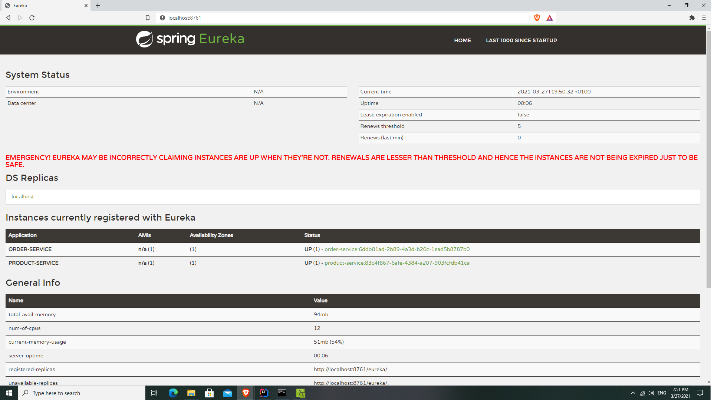

[[chapter-2]]
= Service Discovery using Spring Cloud Netflix Eureka

We are going to implement the Service Discovery Pattern in our microservices using the *Spring Cloud Netflix Eureka* project.

We will start off by creating the service discovery server at https://start.spring.io/[start.spring.io] website.

To create the discovery server, we need to just add one dependency – `Eureka Server`, once you download the project to your machine, we can enable the Eureka Server functionality by adding the `@EnableEurekaServer` annotation.

[source,java]
.src/main/java/com/programming/techie/discoveryserver/DiscoveryServerApplication.java
----
package com.programming.techie.discoveryserver;

import org.springframework.boot.SpringApplication;
import org.springframework.boot.autoconfigure.SpringBootApplication;
import org.springframework.cloud.netflix.eureka.server.EnableEurekaServer;

@SpringBootApplication
@EnableEurekaServer
public class DiscoveryServerApplication {

    public static void main(String[] args) {
        SpringApplication.run(DiscoveryServerApplication.class, args);
    }

}
----

By default, our Eureka Server is running in a standalone mode, and it also acts as a client, but there is no need to register the eureka instance with itself, for this reason, we are going to add the following configuration to the `application.properties` file

[source, text]
----
server.port=8761
eureka.client.register-with-eureka=false
eureka.client.fetch-registry=false
----

Once we add the above properties, we can start the `DiscoveryServerApplication` class, once you start the application, you can open the Eureka Dashboard at http://localhost:8761/

== Registering Micro Services as Eureka Clients

Now it’s time to register our `Product Service` and `Order Service` with our Eureka Server, add the following dependency to `pom.xml` file of both `product-service` and `order-service`.

[source, xml]
.pom.xml
----
<dependency>
    <groupId>org.springframework.cloud</groupId>
    <artifactId>spring-cloud-starter-netflix-eureka-client</artifactId>
</dependency>
----

We also have to add the `@EnableEurekaClient` to the `ProductServiceApplication` and `OrderServiceApplication` classes.

*ProductServiceApplication.java*

[source, java]
.src/main/java/com/programming/techie/productservice/ProductServiceApplication.java
----
package com.programming.techie.productservice;

import org.springframework.boot.SpringApplication;
import org.springframework.boot.autoconfigure.SpringBootApplication;
import org.springframework.cloud.netflix.eureka.EnableEurekaClient;

@SpringBootApplication
@EnableEurekaClient
public class ProductServiceApplication {

    public static void main(String[] args) {
        SpringApplication.run(ProductServiceApplication.class, args);
    }

}
----

*OrderServiceApplication.java*

[source, java]
.src/main/java/com/programming/techie/productservice/ProductServiceApplication.java
----
package com.programming.techie.productservice;

import org.springframework.boot.SpringApplication;
import org.springframework.boot.autoconfigure.SpringBootApplication;
import org.springframework.cloud.netflix.eureka.EnableEurekaClient;

@SpringBootApplication
@EnableEurekaClient
public class ProductServiceApplication {

    public static void main(String[] args) {
        SpringApplication.run(ProductServiceApplication.class, args);
    }

}
----

We need to add the details of the Eureka Service inside the `application.properties` file, so that both `product-service` and `order-service` can communicate and register with the discovery server.

*Product Service’s application.properties file*

[source,text]
.application.properties
----
spring.application.name=product-service
server.port=0
eureka.instance.instance-id=${spring.application.name}:${random.uuid}
spring.data.mongodb.uri=mongodb://localhost:27017/product-service
----

*Order Service’s application.properties file*
[source,text]
.application.properties
----
spring.application.name=order-service
server.port=0
eureka.instance.instance-id=${spring.application.name}:${random.uuid}

spring.datasource.url=jdbc:mysql://localhost:3306/order-service
spring.datasource.driver-class-name=com.mysql.cj.jdbc.Driver
spring.jpa.properties.hibernate.dialect=org.hibernate.dialect.MySQL8Dialect
spring.jpa.hibernate.ddl-auto=update
spring.datasource.initialization-mode=always
spring.jpa.show-sql=true
spring.datasource.username=root
spring.datasource.password=mysql
server.port=0
----

When you start both the applications, they will communicate with the Eureka Server which is running at default port 8761. The Eureka Clients will send heartbeat signals to the Server to inform that they are still up and running, when the client stops sending the heartbeat signals after reaching the expected threshold limit, Eureka Server will mark those clients as unhealthy.

We also set the property `eureka.instance.instance-id` property to a combination of the application name + a Random UUID, so that each instance of our service will be displayed inside the Eureka Dashboard.

Now if you open the Eureka Dashboard at http://localhost:8761/ you should see both Product Service and Order Service.

In the next chapter, we will discuss how to implement Centralized Configuration using *Spring Cloud Config Server*
